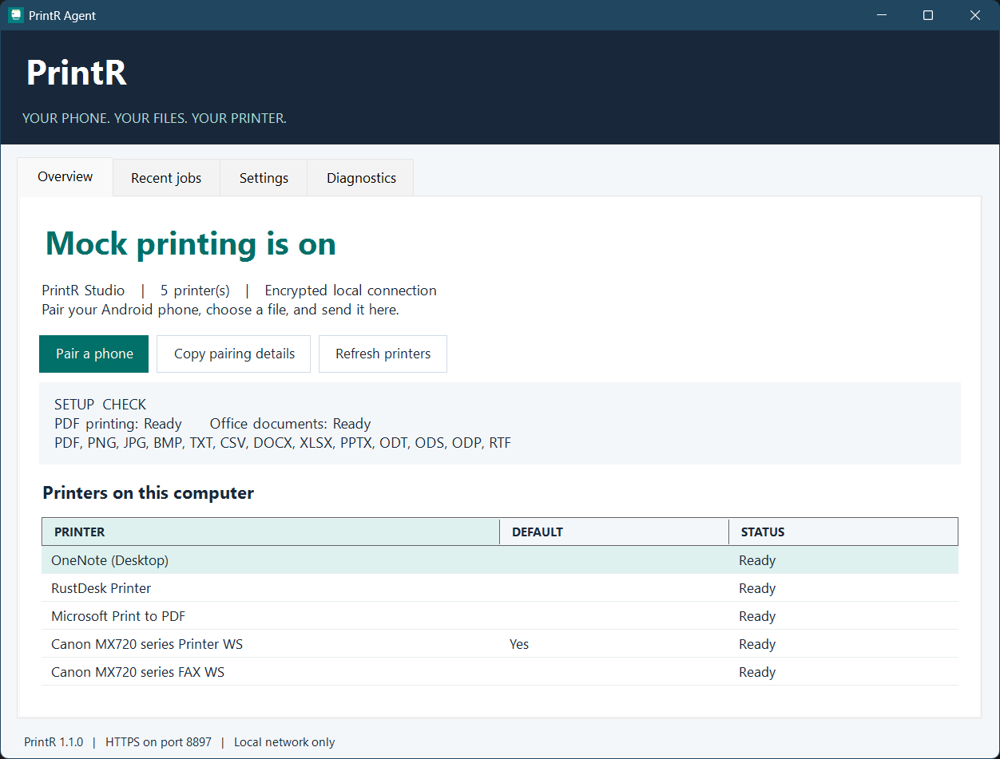
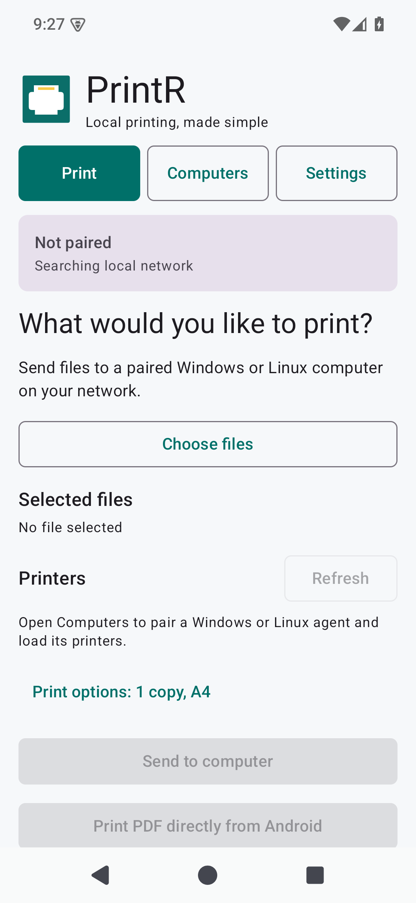
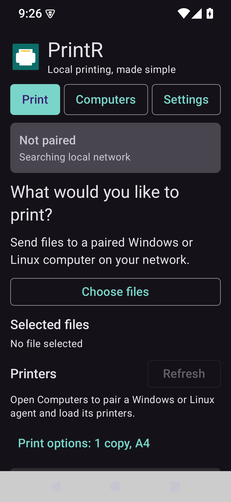
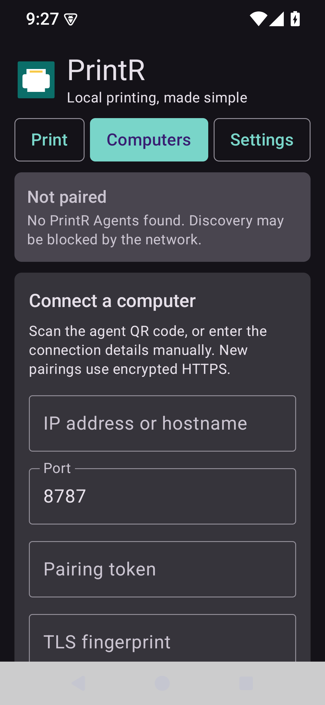
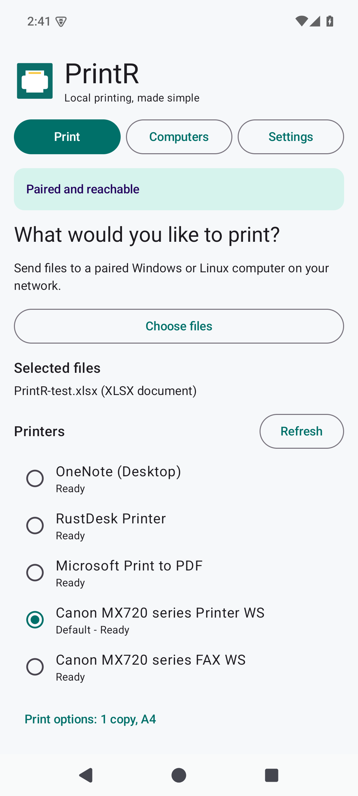
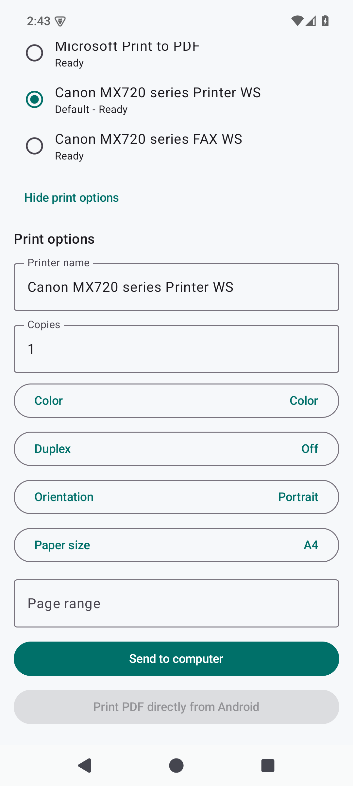
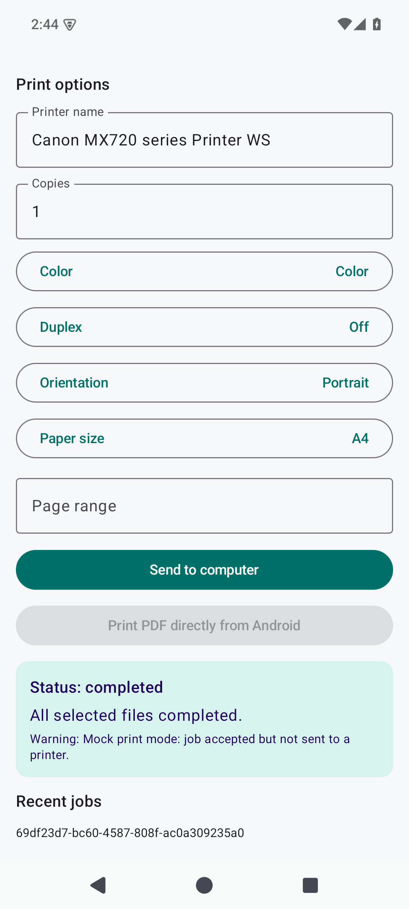
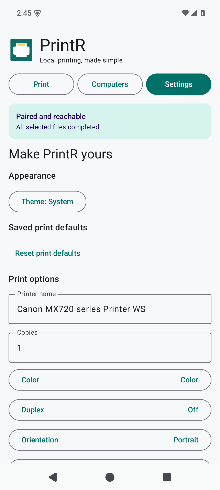
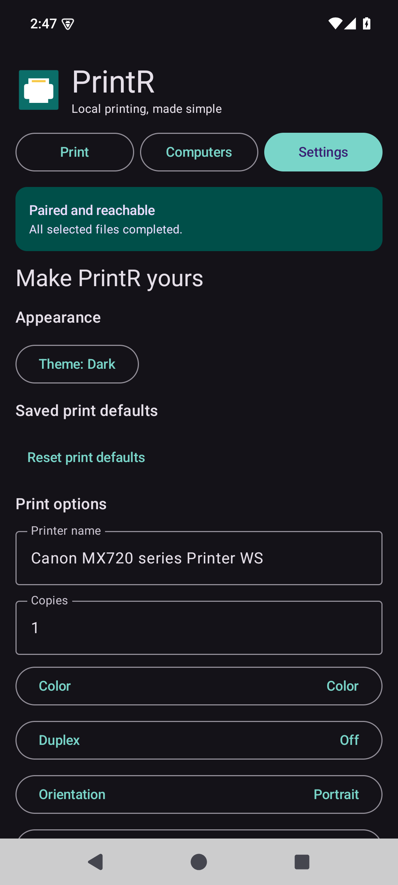
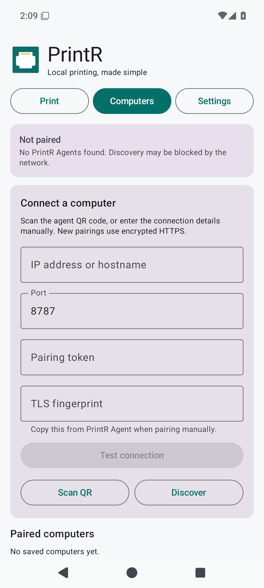

# PrintR 1.1 screenshots

Captured from the running Windows application and Android API 35 emulator on 20 September 2026. These are real application captures, not mockups. The Windows instance uses an isolated local test profile with mock printing enabled. The completed XLSX jobs did not send paper to a printer.

## Windows

The Overview and Recent jobs images are the user-provided captures. The header and status sections size to their text, with an explicit DPI baseline and additional text padding. The window is constrained to the monitor work area at startup.

- [Settings after the fix](screenshots/windows-settings.png): upload limits, timeout, tool paths, startup, retention and mock mode. Content-sized rows preserve the complete Restart agent, Rotate token and Browse button borders.
- [Recent jobs](screenshots/windows-jobs.png): the XLSX job received from Android.
- [User-provided Settings reference, before the fix](screenshots/windows-settings-before-fix.png): retained unchanged to document the clipped borders.

## Android

### Android 1.1.1 layout correction

Real API 35 emulator captures at a 360 dp viewport (1080 by 2340 pixels). The light capture uses normal text size; the dark Print and Computers captures use 1.3x font scaling. These show smaller corners and complete navigation labels. The manual pairing fields are empty.

  
  
  

### Android 1.1.0 workflow captures

Captured at 1080 by 2400 pixels from the API 35 emulator. The phone paired over pinned HTTPS with the local Windows test agent, enumerated its printers and submitted a real XLSX upload in mock mode.

  
  
  

  
  
  

- [Print screen](screenshots/android-print.png): paired Windows agent, selected XLSX document and real printer enumeration.
- [Print options](screenshots/android-options.png): copies, color, duplex, orientation, paper size and page range.
- [Computers](screenshots/android-computers.png): empty manual pairing form, with no credentials exposed.
- [Settings](screenshots/android-settings.png): appearance and saved print defaults.
- [Dark theme](screenshots/android-dark.png): the same settings with dark appearance.
- [Completed mock print](screenshots/android-completed.png): completion status and explicit no-paper warning.

No pairing QR code, token or private certificate is included. Linux is a background service with command-line administration, so there is no Linux desktop GUI screenshot.
